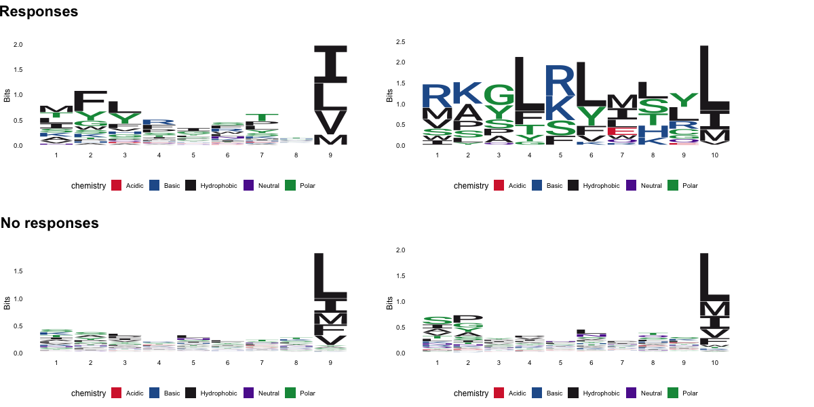

```{r setup, include=FALSE}
knitr::opts_chunk$set(echo = FALSE)
```

## Introduction {.smaller}
### Rationale of the study

## Background Information
### **Neoepitopes derived from somatic mutations in the tumor**

- <font size="4">High tumor mutational burden (TMB) correlates with neopeptide expression</font>
- <font size="4">They allow the distinction between healthy vs tumor cells</font>


## 
### **How T Cells see the cancer cells?**


##
#### **NeoPepVac: a personalized therapeutic neopeptide-based vaccine**


##
#### **Everything starts with a bioinformatician predicting neoepitopes: Mupexi**

- <font size="4">NGS pipeline: neoepitope prediction includes 24 scripts</font>


##
### **Experimental side**


## Our Data
```{r, include=FALSE}
library("tidyverse")
library(readxl)
```

## Data


## Our Data


## Objective
#### What characteristics make neoepitopes elicit tumor-specific CD8 T cell responses?
- Combine xx_library_mupexi file with xx_barracoda file.
- Plot different characteristics of the responses vs no-responses neoepitopes.
- Store data wrangling and plotting functions into an R package.
- Develop a simple Shinny app to visualize the plots.
- Train an ANN to predict responses from the response/no response data

## Objective


## Project Roadmap


## Project Roadmap


## 04_analysis

## Baracoda response analysis 


## overview of CB and IB 


## Rank and expression level 


## Mutations possition 

## SEQ logos 

## Modelling 


## shiny_app
- Plotting away :)


## R packages coming

## Discussion

## Conclusion