```{r setup, include=FALSE}
knitr::opts_chunk$set(echo = FALSE)
```

## Neoepitopes arise from somatic mutations in the tumor

<center>

<div style="float: left; width: 40%;">
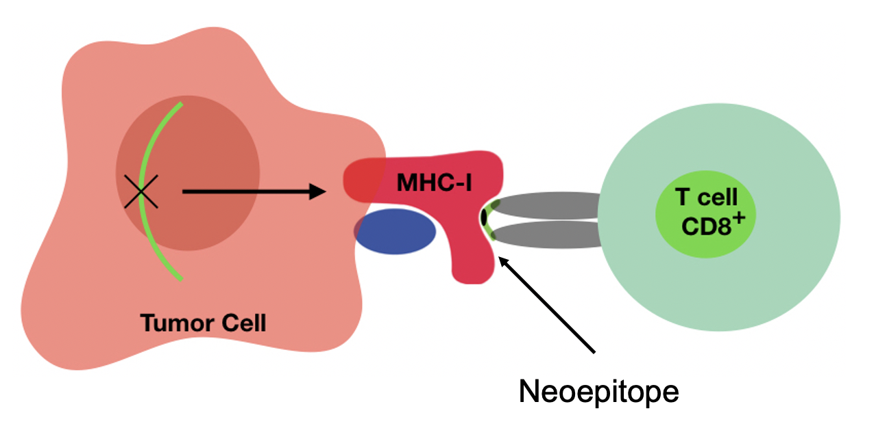
</div>

<div style="float: right; width: 60%;">
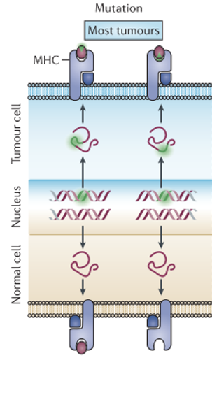
</div>

<center>

## Data generation from mouse tumor models
<div style="float: left; width: 40%;">
- Two cell lines (CT26 colon carcinoma and 4T1 breast cancer)
- Two organs (spleen and tumors)
- With and without checkpoint inhibitor treatment
</div>
<div style="float: right; width: 60%;">
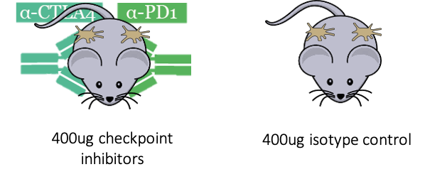
</div>
<div align="center">
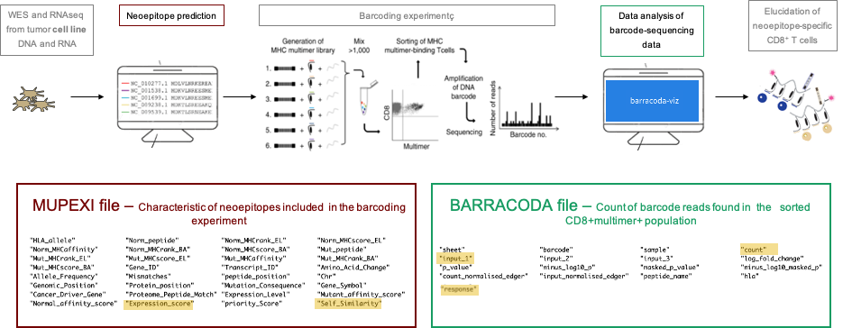
</div>

## Objectives
 Elucidation of detected neoepitope characteristics


## Method
- Roadmap of data analysis in the code

<div align="center">
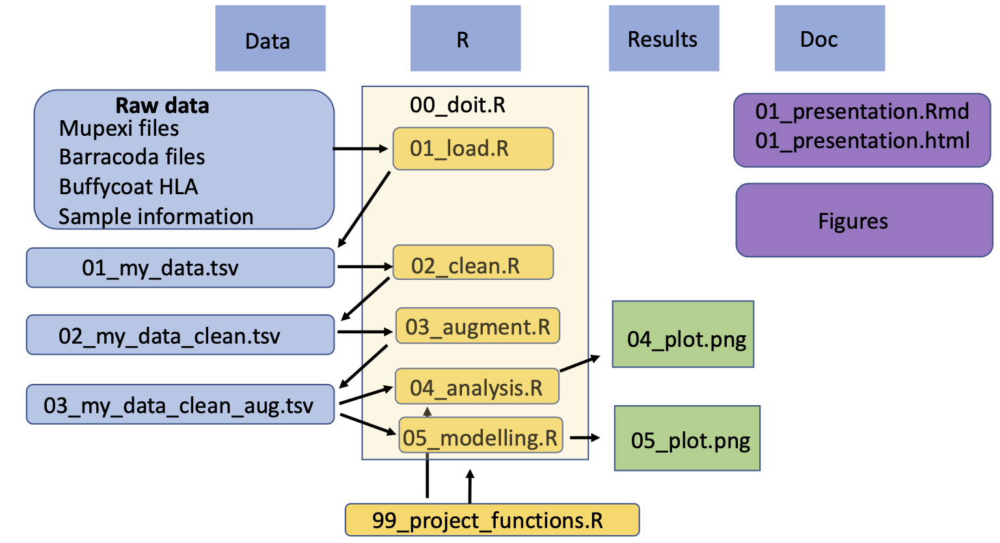
</div>

# Results


## Response filtering {#slide3} 
- Response selection criteria: logfold change > 2 and p-value < 0.01

<center>

{width=80%}

<center>
## Barracoda selection {#slide4} 
- I dont know how to remove thw white space to make the plot bigger
- lof fold change of barcode reads across cell lines and treatments

<center>

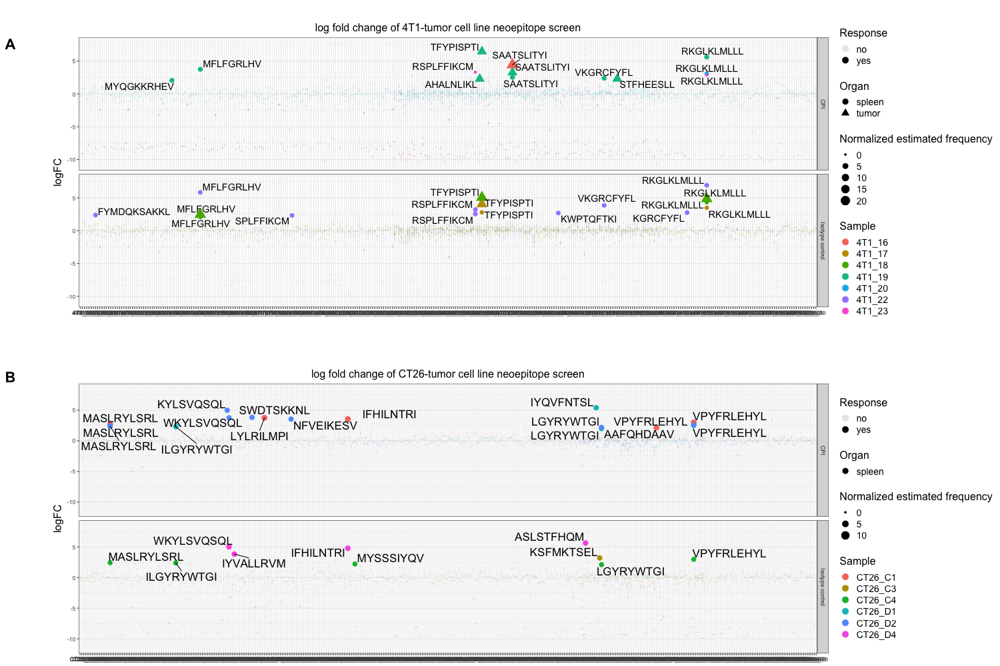{width=70%}

<center>

## Expression level and rank score {#slide8} 
- Now selction criteria is rank < 2% and expression > 0.1 TPM
- Can these selection critereia be optimized 
<div align="center">
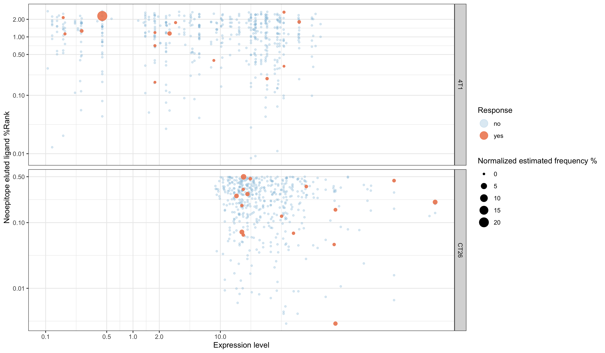
</div>


## Mutation consequence 
<div style="float: left; width: 40%;">
- Can mutation type be used to find immunugenic neoepitopes? 
</div>

<div style="float: right; width: 60%;">
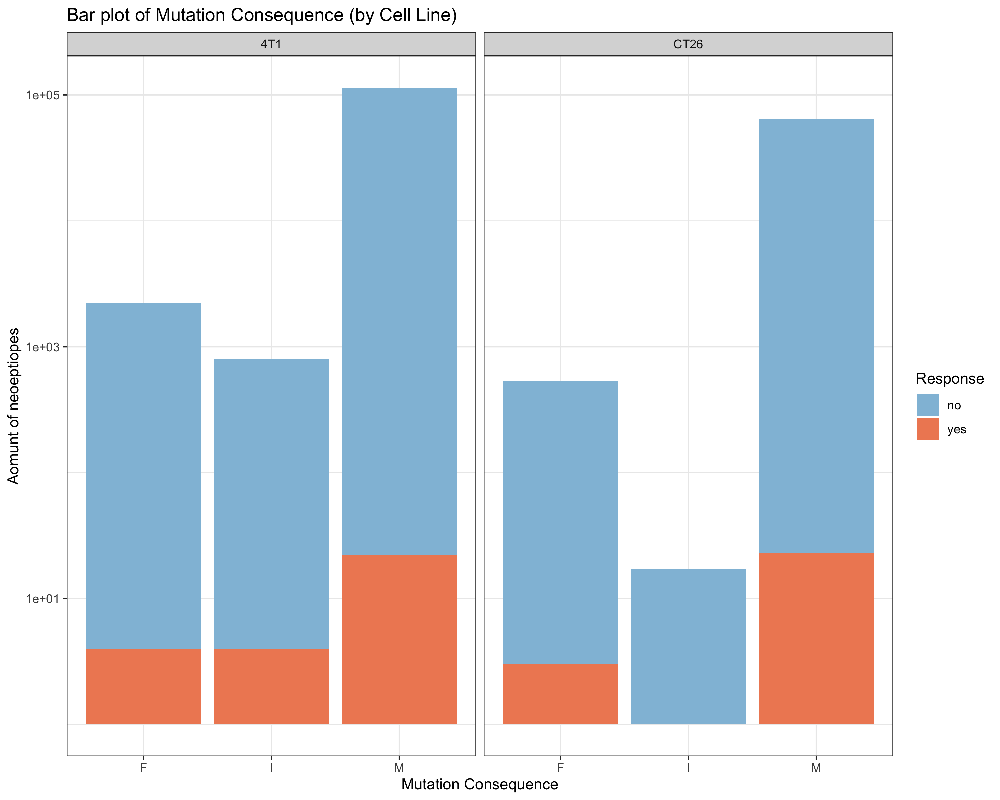
</div>


## Elution, binding affinity rank scores and self-similarity {#slide5}

<center>

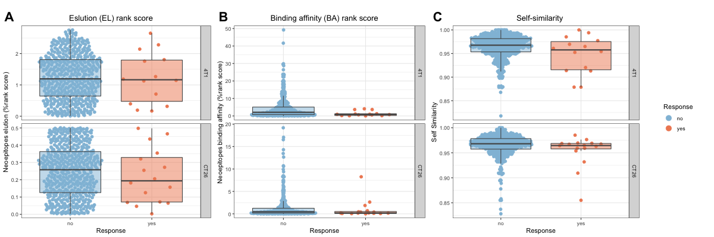{width=90%}

<center>

## Improved binding affinity 

<center>

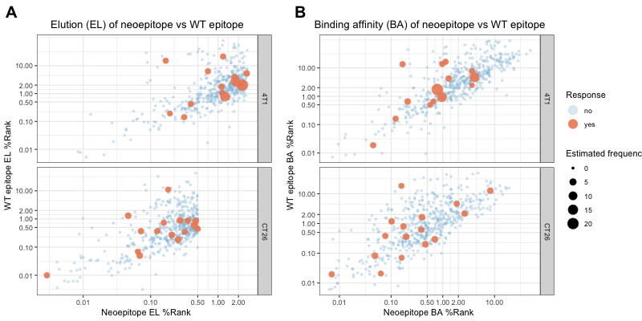

<center>

## Mutation position {#slide6} 

<center>

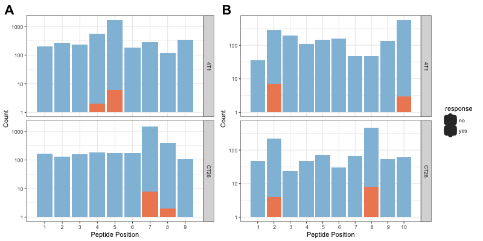{width=90%}

<center>


## GGseq logo 
<div align="center">
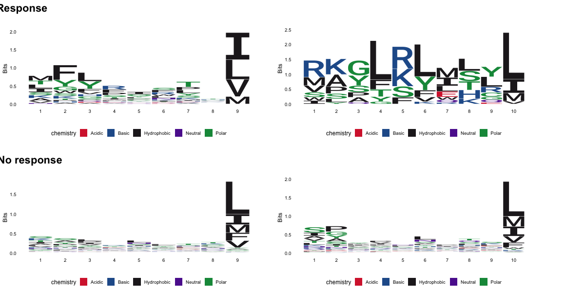
</div>

## Modelling
<div align="center">
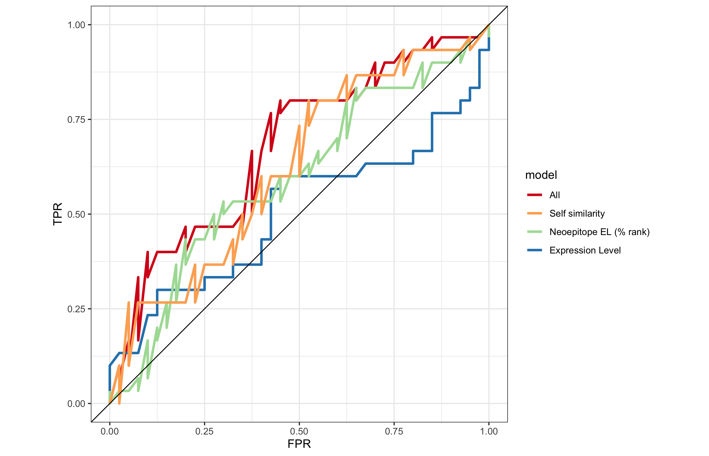
</div>

## Discussion
- Data set is to small to see a clear pattern in immnunugenic and non-immunugenic neoepitopes

Further work:

- Try out with more data, when more peptides are screened
- Is the results the same for human data 
- Make packages for human data 

## R package and shiny app
<div style="float: left; width: 40%;">
We have developed [barcc](https://github.com/rforbiodatascience/barcc) package
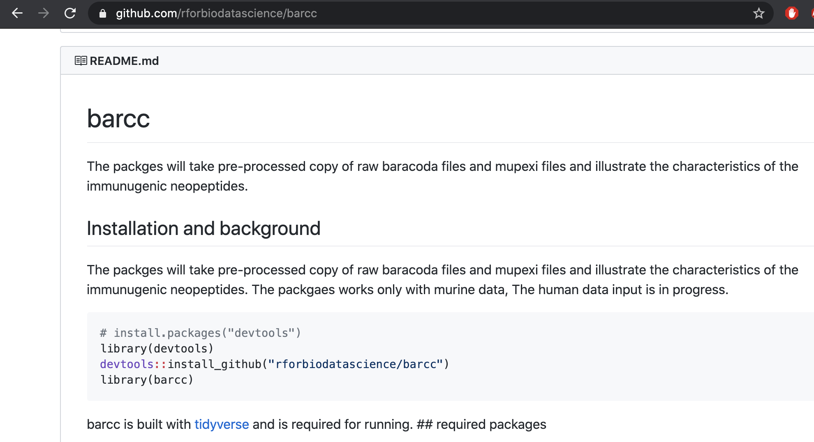
</div>
<div style="float: right; width: 60%;">
And a [shiny app](https://annie-borch.shinyapps.io/exploring_data/) for rapid visualization of the data
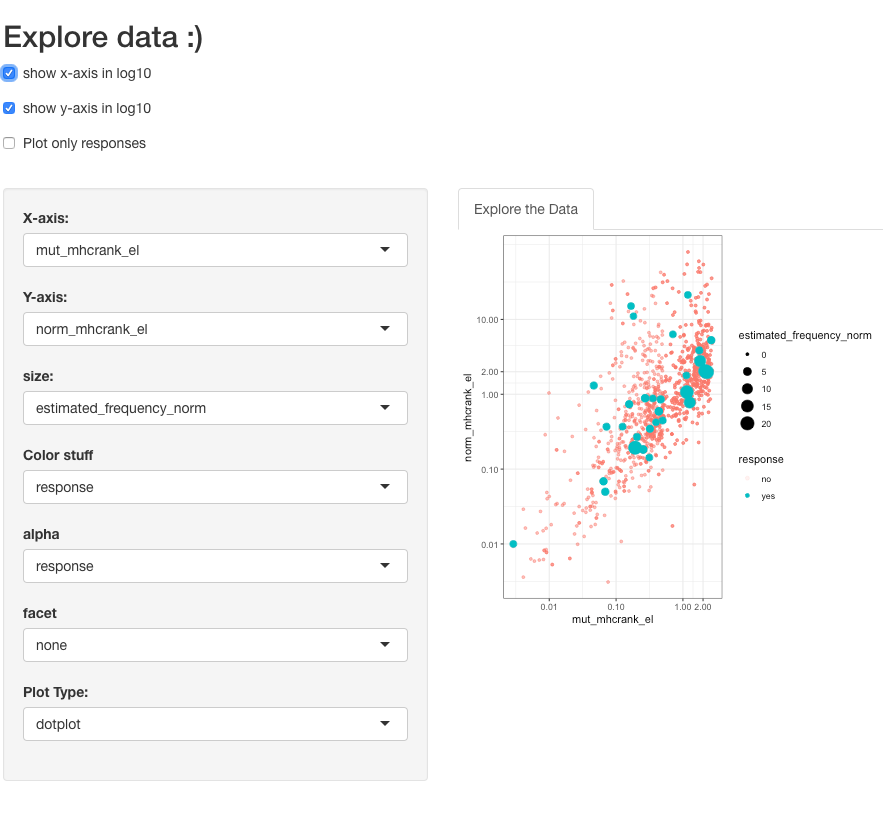
</div>


