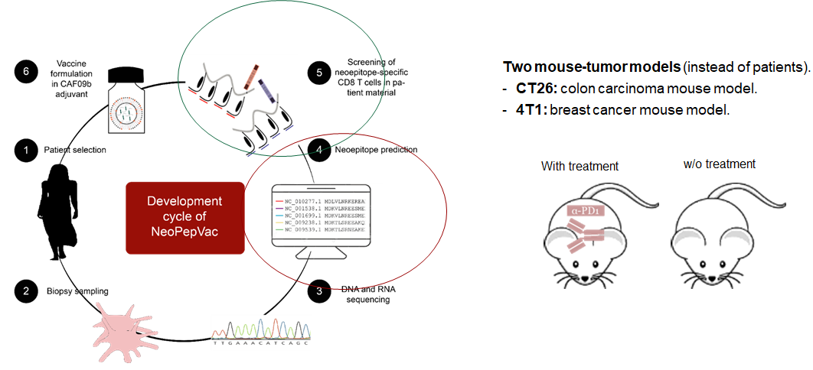
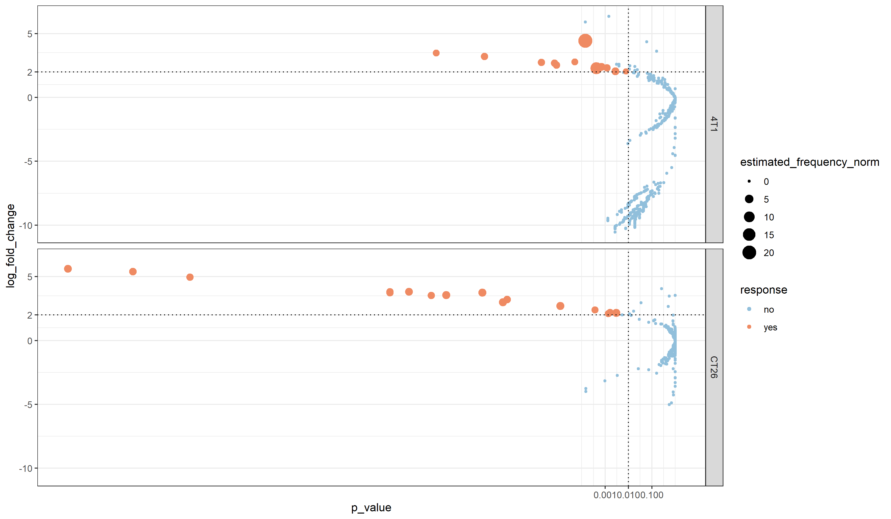
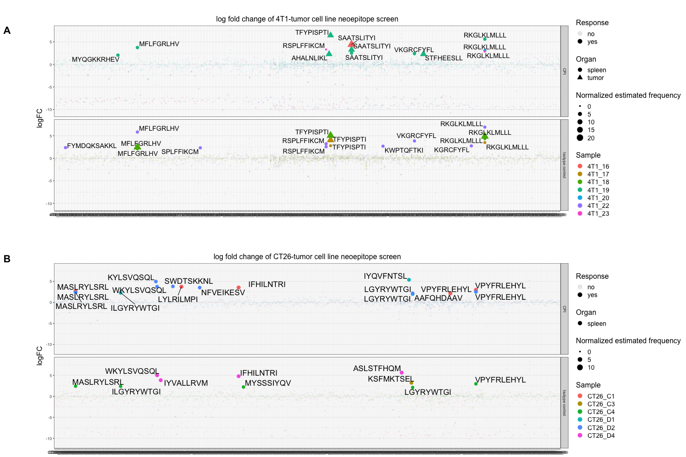
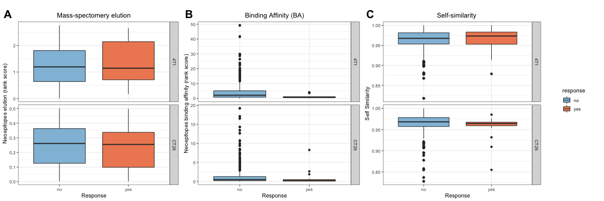
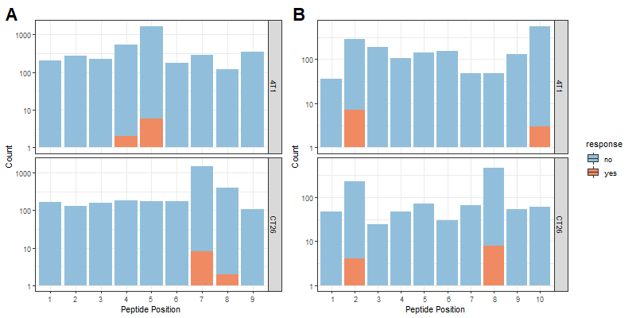
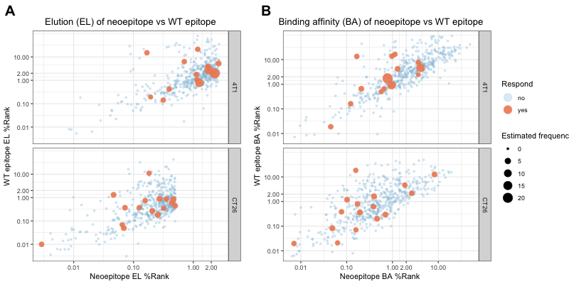

```{r setup, include=FALSE}
knitr::opts_chunk$set(echo = FALSE)
```
## Introduction

{width=80%}
## Method

## Results
- Barracoda selection
- Response vs non-response neoepitope characteristics
- Neoepitope characteristics and estimated frequencies of responses

## Barracoda selection {#slide3} 
- Response selection criteria: logfold change > 2 and p-value < 0.01

<center>

{width=80%}

<center>
## Barracoda selection {#slide4} 
- I dont know how to remove thw white space to make the plot bigger
- lof fold change of barcode reads across cell lines and treatments

<center>

{width=70%}

<center>

## Response vs non-response characteristics {#slide5}

<center>

{width=90%}

<center>


## Neoepitope characteristics - mutation position {#slide6} 

<center>

{width=90%}

<center>

## Neoepitope characteristics and estimated frequencies

<center>



<center>

## Expression level 

<center>


<center>


