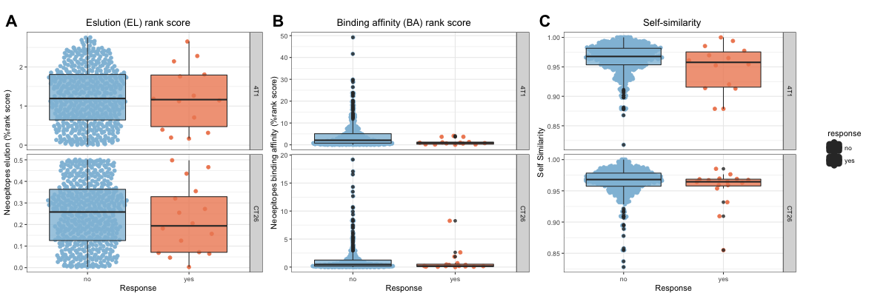

```{r setup, include=FALSE}
knitr::opts_chunk$set(echo = FALSE)
```

## Neoepitopes arise from somatic mutations in the tumor... 

<center>

...they are not expressed in normal cells and are optimal targets for immunetherapy approaches

{width=40%}

<center>


## Objectives - Elucidation of detected neoepitope characteristics 

<center>

<font size="4"> - Merging Mupexi file with Barracoda file</font>

{width=90%}

<center>

## Method {.columns-2 .smaller}

- Data generation from mouse tumor models
- Two cell lines (CT26 colon carcinoma and 4T1 breast cancer)
- Two organs (spleen and tumors)
- With and without checkpoint inhibitor treatment

- Structure in two columns.
- Roadmap of data analysis in the code

## Results
- Barracoda selection
- Response vs non-response neoepitope characteristics
- Neoepitope characteristics and estimated frequencies of responses

## Barracoda selection {#slide3} 
- Response selection criteria: logfold change > 2 and p-value < 0.01

<center>

{width=80%}

<center>
## Barracoda selection {#slide4} 
- I dont know how to remove thw white space to make the plot bigger
- lof fold change of barcode reads across cell lines and treatments

<center>

{width=70%}

<center>

## Response vs non-response characteristics {#slide5}

<center>

{width=90%}

<center>


## Neoepitope characteristics - Mutation position {#slide6} 

<center>

{width=90%}

<center>

## Neoepitope characteristics and estimated frequencies {#slide7} 

<center>


<center>

## Expression level and rank score {#slide8} 
- Now selction criteria is rank < 2% and expression > 0.1 TPM
- Can these selection critereia be optimized 
<div align="center">

</div>


## Mutation consequence 
<div style="float: left; width: 40%;">
- Frameshit as biomarker for benefit with CPI 
- Can frameshift then be used to find immunugenic neoepitopes ? 
</div>

<div style="float: right; width: 60%;">

</div>

## GGseq logo 
<div align="center">

</div>

## Discussion
- Data set is to small to see a clear pattern in immnunugenic and non-immunugenic neoepitopes
- A trend that .....

## Further work
- Try out with more data, when more peptides is screened
- Is the results the same for human data 
- Make packages for human data 

