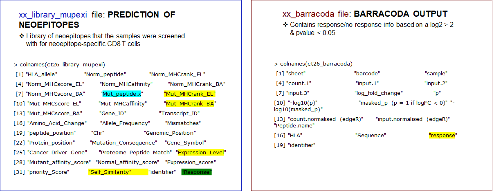
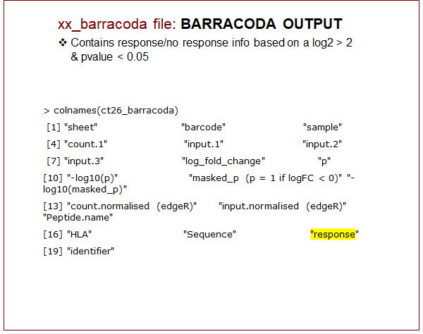
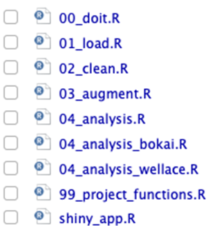
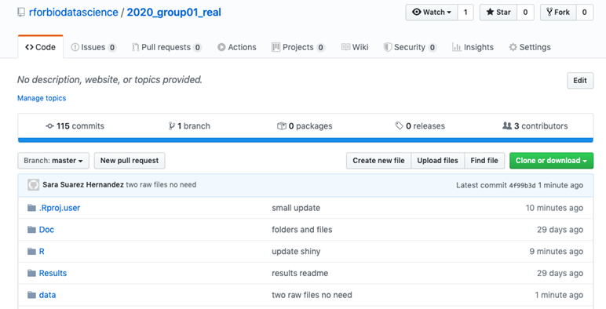
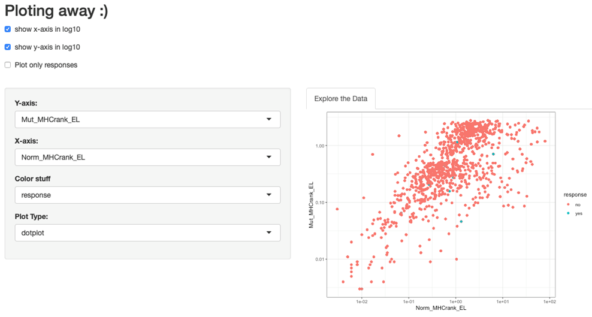

```{r setup, include=FALSE}
knitr::opts_chunk$set(echo = FALSE)
```

## Introduction {.smaller}
### Rationale of the study

## Background Information
### **Neoepitopes derived from somatic mutations in the tumor**

- <font size="4">High tumor mutational burden (TMB) correlates with neopeptide expression</font>
- <font size="4">They allow the distinction between healthy vs tumor cells</font>


## 
### **How T Cells see the cancer cells?**


##
#### **NeoPepVac: a personalized therapeutic neopeptide-based vaccine**


##
#### **Everything starts with a bioinformatician predicting neoepitopes: Mupexi**

- <font size="4">NGS pipeline: neoepitope prediction includes 24 scripts</font>


##
### **Experimental side**


## Our Data
```{r, include=FALSE}
library("tidyverse")
library(readxl)
```

```{r, include=FALSE}
#file.choose()
source(file = "../../2020_group01_real_version04/R/99_project_functions.R")

# Load data
# ------------------------------------------------------------------------------
my_data <- read_tsv(file = "../../2020_group01_real_version04/data/01_my_data.tsv")
my_data_clean <- read_tsv(file = "../../2020_group01_real_version04/data/02_my_data_clean.tsv")
my_data_clean_aug <- read_tsv(file = "../../2020_group01_real_version04/data/03_my_data_clean_aug.tsv") 

```



## Our Data


## Objective
#### What characteristics make neoepitopes elicit tumor-specific CD8 T cell responses?
- Combine xx_library_mupexi file with xx_barracoda file.
- Plot different characteristics of the responses vs no-responses neoepitopes.
- Store data wrangling and plotting functions into an R package.
- Develop a simple Shinny app to visualize the plots.
- Train an ANN to predict responses from the response/no response data

## Objective


## Project Roadmap


## Project Roadmap


## 00_doit
**Raw files**
```
# Run all scripts
# ------------------------------------------------------------------------------
source(file = "R/01_load.R")
source(file = "R/02_clean.R")
source(file = "R/03_augment.R")
source(file = "R/04_analysis.R")
```

## 01_load

- Import Barracoda files (and merge)
```{r}
colnames(all_ct26_barracoda_raw)
```
- Import Mupexi files (and merge)
```{r}
colnames(all_ct26_barracoda_raw)
```
- Import sample_info and MHC_info sheets
```{r}
colnames(all_ct26_barracoda_raw)
```
- Merge all into my_data
```{r}
colnames(all_ct26_barracoda_raw)
```

## 02_clean
- Remove redundant columns or introduced due to excel file import (as …17)
- Round numeric colums to 3 decimals
- Remove control samples that were present in Barracoda but not in Mupexi and introduced NAs in the peptide characteristics

**input**
```{r}
colnames(mydata)
```
**output**
```{r}
colnames(my_data_clean)
```

- Output: **my_data_clean**

## 03_augment
- New columns added:
  + Response
  + Organ
  + Treatment
  + Percent_count.fraction
  + Estimated_frequency
 
```{r}
colnames(my_data_clean_aug)
```

- Output: **my_data_clean_augment**

## 04_analysis
- Plotting done is two files to avoid merging problems
```
04_analysis.R
04_analysis_bokai.R
04_analysis_wellace.R
```
```{r}
scatterplot_function('mut_mhcrank_el','norm_mhcrank_el')+
  labs(title= "Elution rank score of neoepitope vs WT epitope", x= "Neoepitope elution rank ", y="WT epitope elution rank")
```

```{r}
# boxplot of self-similarity vs response, facet by cell line
box_function('response','self_similarity') +
  facet_wrap(cell_line~.) +
  labs(title ="Box plot of Self Similarity vs Response (by Cell Line)", x = "Response", y = "Self Similarity")
```

## shiny_app
- Plotting away :)


## R packages coming

## Discussion

## Conclusion