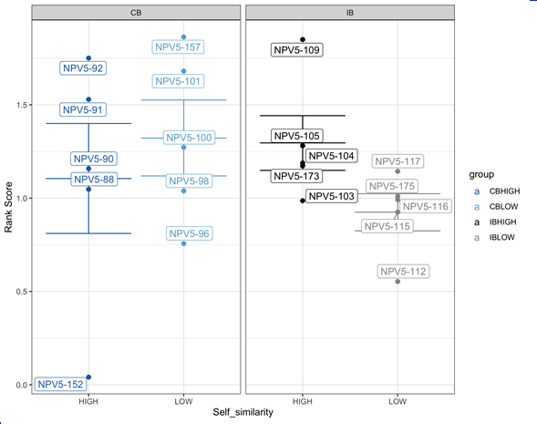

```{r setup, include=FALSE}
knitr::opts_chunk$set(echo = FALSE)
```

## Introduction
### **Neoepitopes derived from somatic mutations in the tumor**

- <font size="4">High tumor mutational burden (TMB) correlates with neopeptide expression</font>
- <font size="4">They allow the distinction between healthy vs tumor cells</font>


## 
### **How T Cells see the cancer cells?**


##
#### **NeoPepVac: a personalized therapeutic neopeptide-based vaccine**


##
#### **Everything starts with a bioinformatician predicting neoepitopes: Mupexi**

- <font size="4">NGS pipeline: neoepitope prediction includes 24 scripts</font>


##
### **Experimental side**


## Our Data
```{r, include=FALSE}
library("tidyverse")
library(readxl)
```

```{r, include=FALSE}
#file.choose()
source(file = "../../2020_group01_real_version04/R/99_project_functions.R")

# Load data
# ------------------------------------------------------------------------------
my_data <- read_tsv(file = "../../2020_group01_real_version04/data/01_my_data.tsv")
my_data_clean <- read_tsv(file = "../../2020_group01_real_version04/data/02_my_data_clean.tsv")
my_data_clean_aug <- read_tsv(file = "../../2020_group01_real_version04/data/03_my_data_clean_aug.tsv") 

```


## Objective: What characteristics make neoepitopes elicit tumor-specific CD8 T cell responses?
```{r, include=FALSE}
library(xaringan)
```
.pull-left[
- Combine xx_library_mupexi file with xx_barracoda file.
- Plot different characteristics of the responses vs no-responses neoepitopes.
- Store data wrangling and plotting functions into an R package.
- Develop a simple Shinny app to visualize the plots.
- Train an ANN to predict responses from the response/no response data
]

.pull-right[

]


## Getting Started

- Create a new R Markdown file in RStudio by going to  
File > New File > R Markdown...
- Click the "presentation" tab
- Enter a title, author, and select what kind of slideshow you ultimately want (this can all be changed later)

## Getting Started
The beginning of an R Markdown file looks like this:<br><br>
`---`  
`title: "Air Quality"`  
`author: "JHU"`  
`date: "May 17, 2016"`  
`output: html_document`  
`---`<br><br>
The new document you've created will contain example text and code below this -- delete it for a fresh start.

## Making Your First Slide
- Title your first slide using two # signs: <br> `## Insert Title Here`
- To make a slide without a title, use three asterisks:<br> `***`
- You can add subheadings with more # signs: <br>
`### Subheading` or `#### Smaller Subheading`
- To add a new slide, just add another Title: <br> `## New Slide Title`

## Adding Text
- Add bullet points to a slide using a hyphen followed by a space: <br>
`- bullet point`
- Add sub-points using four spaces and a plus sign:<br>
&nbsp;&nbsp;&nbsp;&nbsp;`+ sub-point`
- Add an ordered list by typing the number/letter: <br>
`1. first point`<br>
&nbsp;&nbsp;&nbsp;&nbsp;`a) sub-sub-point`
- Add bullet points that appear one by one (on click) with:<br>
`>- iterated bullet point`

## Formatting Text
              Text                               Code in R Markdown
----------------------------------    ----------------------------------------
           plain text                              `plain text`  
           *italics*                               `*italics*`  
           **bold**                                `**bold**` 
  [link](http://www.jhsph.edu)          `[link](http://www.jhsph.edu)`  
          `verbatim code`                          ` `code here` `
 
## Embedding R Code
This is a chunk of R code in R Markdown:<br><br>
\`\`\`{r} <br>
`head(airquality)`<br>
\`\`\`  
The code gets run, and both the input and output are displayed.
```{r}
head(airquality)
```

## Embedding R Code
To hide the input code, use `echo=FALSE`.<br><br>
\`\`\`{r, echo=FALSE} <br>
`head(airquality)`<br>
\`\`\` 
```{r, echo=FALSE}
head(airquality)
```
This can be useful for showing plots.

## Embedding R Code
To show the input code only, use `eval=FALSE`.<br><br>
\`\`\`{r, eval=FALSE} <br>
`head(airquality)`<br>
\`\`\` 
```{r, eval=FALSE}
head(airquality)
```

## Embedding R Code
To run the code without showing input or output, use `include=FALSE`. <br><br>
\`\`\`{r, include=FALSE} <br>
`library(ggplot2)`<br>
\`\`\` 

## Generating Slideshows
- Click the **Knit** button at the top of the R Markdown document to generate your new document.
    + You may be asked to install required packages if you don't already have them installed -- hit "Yes" and RStudio will install them for you
- You can change the type of document generated by changing the `output` line in the header, or by selecting an output from the **Knit** button's pull-down menu.

## Generating Slideshows
- HTML: two options with different looks
    + `output: ioslides_presentation`
    + `output: slidy_presentation`
- PDF: `output: beamer_presentation`  
- Note: You can specify multiple outputs at the beginning of the R Markdown file if you will need to generate multiple filetypes. 

## PDFs and LaTeX
- To **knit** a PDF slideshow, you will need to install **LaTeX** on your computer
- LaTeX is a typesetting system that is needed to convert R Markdown into formatted text for PDFs

### Downloading and Installing LaTeX
- *LaTeX* is free
- LaTeX takes up a lot of space (almost ~2.6 GB download and takes up ~5 GB when installed)
- Visit [https://www.tug.org/begin.html](https://www.tug.org/begin.html) to download LaTeX for your operating system
- Depending on your internet connection, it may take a while to download due to its size 

## Conclusion

For more information about R Markdown visit http://rmarkdown.rstudio.com/